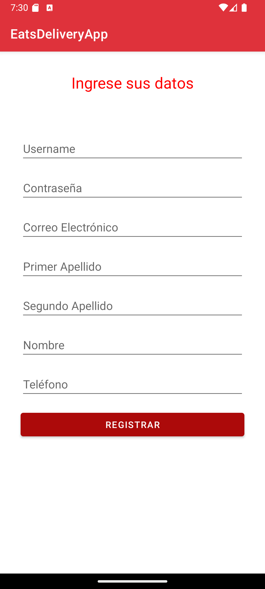
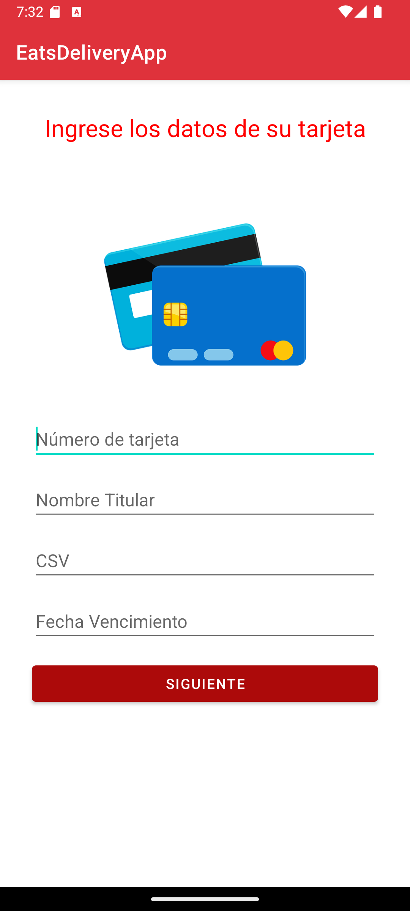
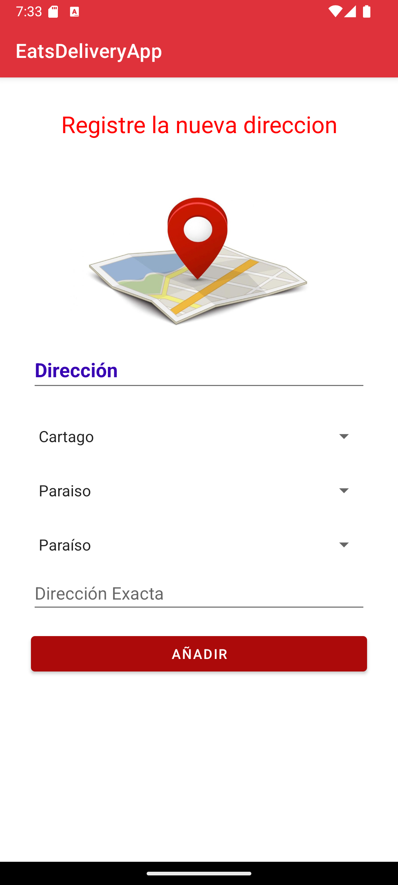
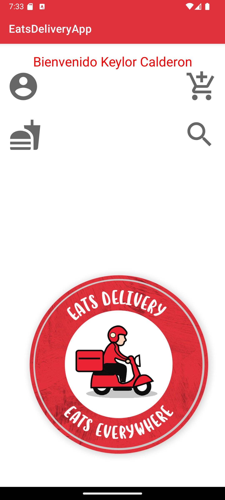
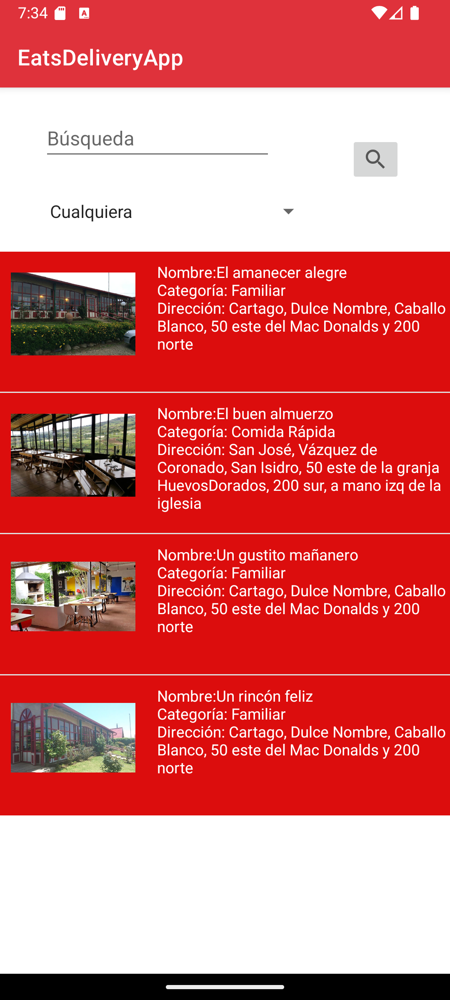
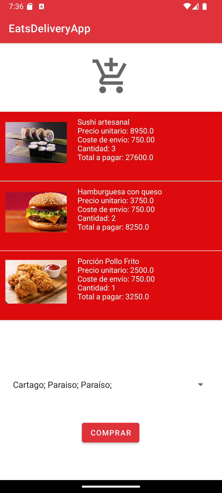

# Eats Delivery App

Native Android food delivery application developed in Java, designed to simulate a real-world online ordering platform with customer and administrator functionalities.

This project was built to replicate core features found in modern delivery applications, including restaurant browsing, cart management, order processing, account management, and administrative CRUD operations.

It was made as an academic project (2021) and later revisited for documentation and portfolio purposes.

## Features

### User Management

- User registration and authentication
- Customer and administrator roles
- Profile information management
- Address registration and management
- Payment card registration

### Restaurant & Product Management

- Restaurant catalog browsing
- Product listing
- Search and filtering functionality
- Full CRUD operations for restaurants and products (Admin)

### Ordering System

- Add/remove items from shopping cart
- Order placement
- Order cancellation
- Order history tracking

### Administrative Functions

- Manage restaurants
- Manage products
- View and manage customer orders
- System content administration

---

## Tech Stack

**Language**

- Java

**Platform**

- Android

**Build System**

- Gradle

**IDE**

- Android Studio

**Architecture**

- Native Android application with role-based access control

---

## Screenshots

### Login



### Payment Method



### Direction Screen



### Home Screen



### Restaurant Catalog



### Product Details


### Shopping Cart



## Key Functionalities Implemented

- Authentication flow
- Role-based access control
- CRUD operations
- Search and filtering
- Shopping cart logic
- Order lifecycle management
- Data persistence
- UI navigation between modules

---

## Technical Challenges Solved

- Managing different user permissions
- Implementing shopping cart state handling
- Structuring CRUD flows for multiple entities
- Migrating and restoring compatibility with modern Android tooling

---

## Running the Project

### Requirements

- Android Studio
- JDK 17+
- Android SDK

### Steps

```bash
git clone https://github.com/KeylorCalderon/Eats-Delivery-app.git
```

Open the project in Android Studio and run it using an emulator or Android device.

---

## Authors

Keylor Calderón, Jhonny Picado Vega and Esteban Vargas Quirós

---

## What I Learned

This project strengthened my understanding of:

- Android native development
- Java application architecture
- UI/UX flow design
- Mobile CRUD implementation
- Gradle build configuration
- Legacy Android project migration and maintenance

---

## Future Improvements

- Payment gateway integration
- Push notifications
- Real-time order tracking
- Backend API integration
- UI modernization
